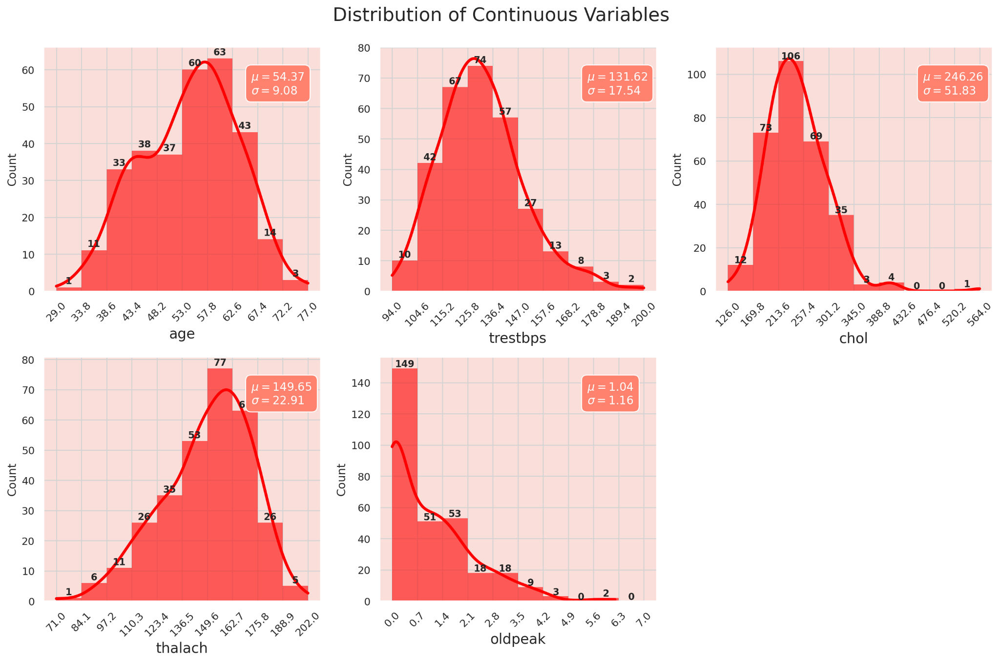
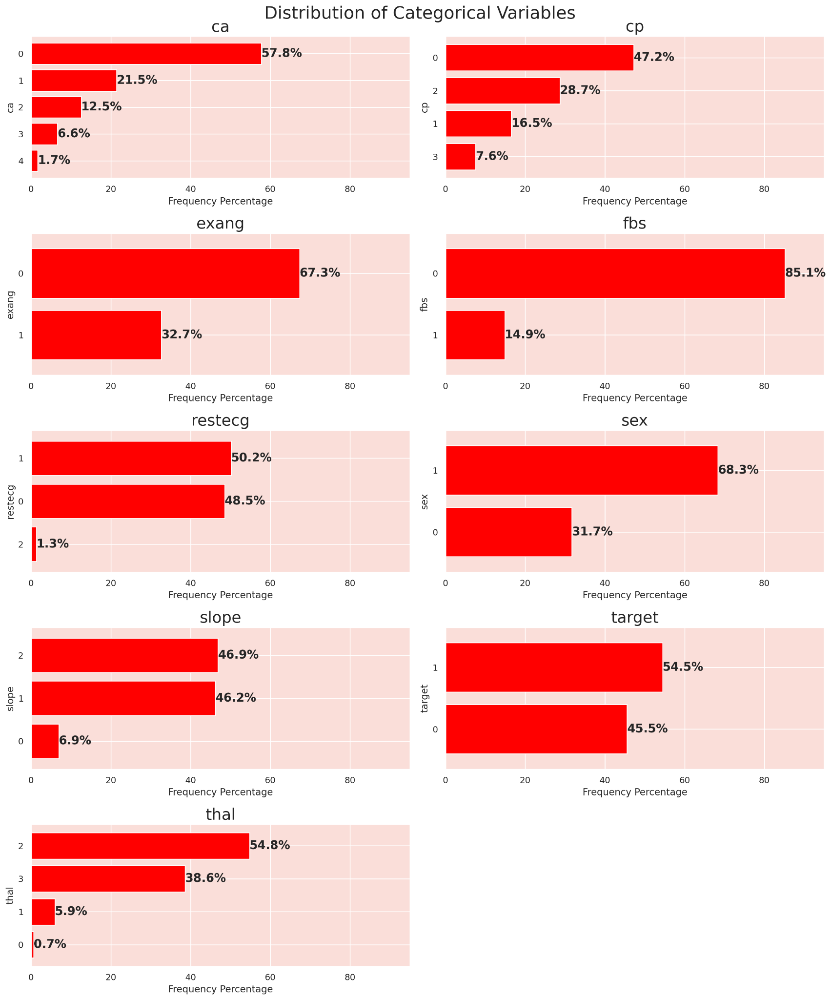
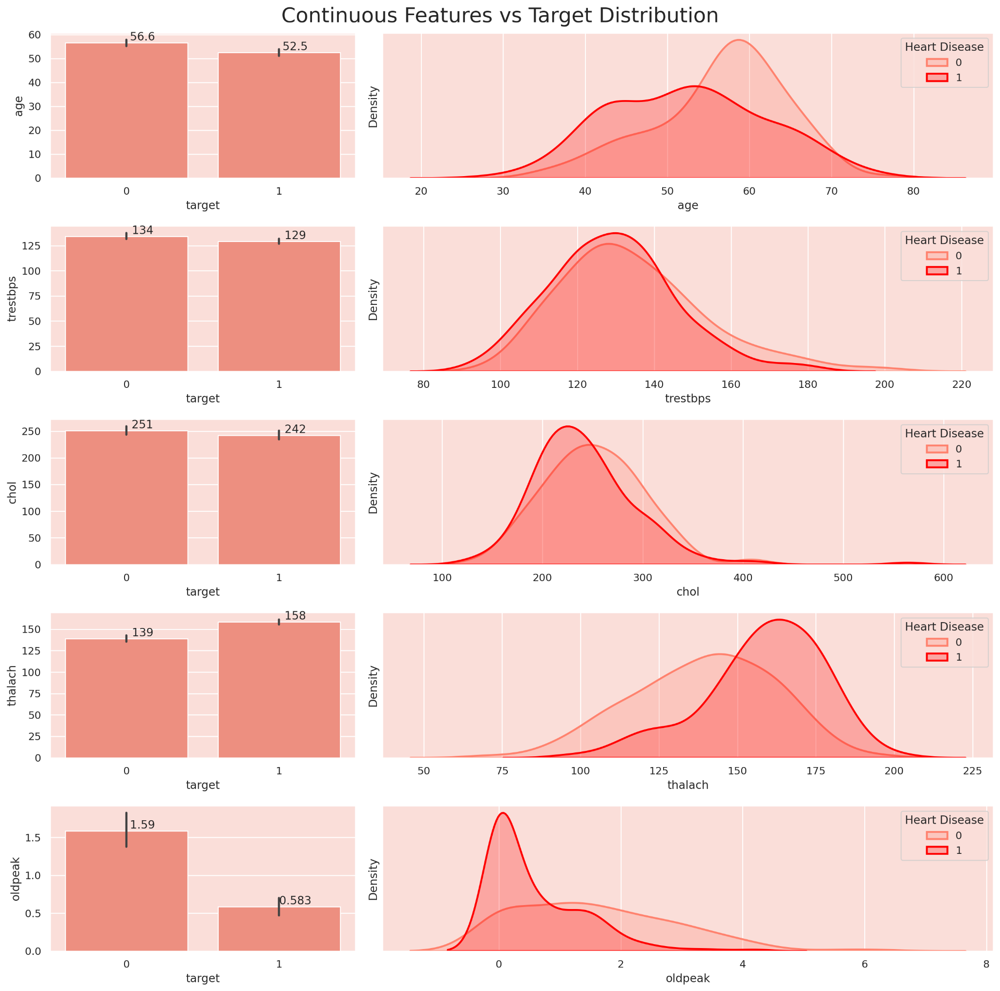
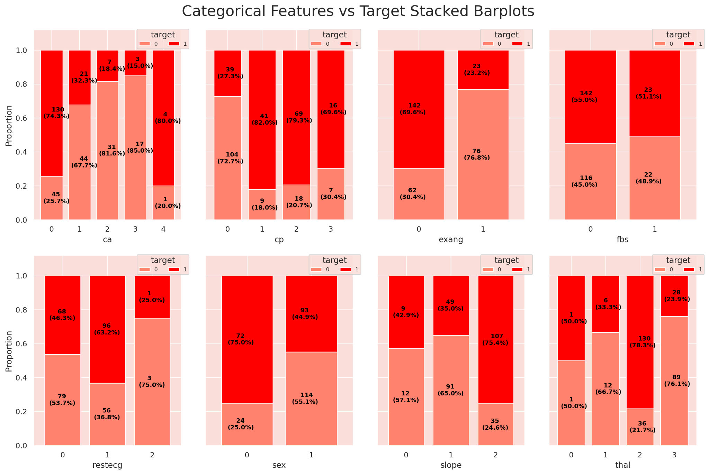
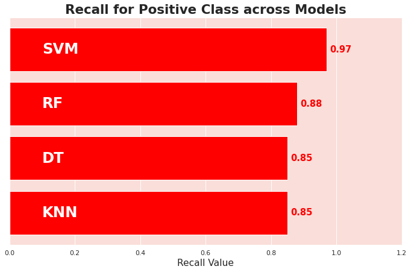

# ❤️ Heart Disease Prediction Using Machine Learning

A machine learning classification project that analyzes patient health and clinical test attributes to predict the presence of heart disease.

The project follows an end-to-end workflow covering data understanding, exploratory data analysis (EDA), preprocessing, feature transformation, model training, hyperparameter tuning, and evaluation of multiple classification algorithms.

## 📌 Project Overview

The objective of this project is to predict whether a patient has heart disease based on demographic information, clinical measurements, and diagnostic test results.

The target variable is:

- `0` → No heart disease
- `1` → Presence of heart disease

Because this is a medical prediction problem, **recall for the positive class (heart disease)** is treated as an especially important metric. A false negative can mean failing to identify a patient who may have the condition.

## 📊 Dataset

The notebook uses a `heart.csv` dataset containing **303 patient records and 14 columns**.

### Features

| Feature | Description |
|---|---|
| `age` | Age of the patient in years |
| `sex` | Gender (`0 = male`, `1 = female`) |
| `cp` | Chest pain type (`0–3`) |
| `trestbps` | Resting blood pressure in mm Hg |
| `chol` | Serum cholesterol in mg/dl |
| `fbs` | Fasting blood sugar above 120 mg/dl (`1 = true`, `0 = false`) |
| `restecg` | Resting electrocardiographic result (`0–2`) |
| `thalach` | Maximum heart rate achieved during a stress test |
| `exang` | Exercise-induced angina (`1 = yes`, `0 = no`) |
| `oldpeak` | ST depression induced by exercise relative to rest |
| `slope` | Slope of the peak exercise ST segment (`0–2`) |
| `ca` | Number of major vessels colored by fluoroscopy (`0–4`) |
| `thal` | Thalium stress test result (`0–3`) |
| `target` | Heart disease status (`0 = no`, `1 = yes`) |

### Dataset Summary

- **Rows:** 303
- **Columns:** 14
- **Missing values:** None
- **Target distribution:** Approximately 54.5% positive and 45.5% negative cases
- **Continuous features:** `age`, `trestbps`, `chol`, `thalach`, `oldpeak`

## 🔎 Exploratory Data Analysis

The notebook performs both univariate and bivariate analysis.

### Univariate Analysis

For continuous features, histograms and KDE plots are used to understand distributions.

For categorical features, frequency bar plots are used.

Some observations from the analysis:

- `age` has an average of approximately 54.4 years.
- `trestbps` is concentrated mainly around 120–140 mm Hg.
- `chol` is mostly distributed between 200–300 mg/dl.
- `thalach` is commonly between 140–170 bpm.
- `oldpeak` is concentrated toward zero.
- The target variable is relatively balanced.

### Bivariate Analysis

Continuous features are compared against the target using mean bar plots and KDE distributions.

Categorical features are analyzed using 100% stacked bar plots.

The notebook identifies `thalach`, `oldpeak`, and `age` as notable continuous features, while `ca`, `cp`, `exang`, `sex`, `slope`, and `thal` show comparatively stronger relationships with the target.

## 🧹 Data Preprocessing

The preprocessing pipeline includes:

### 1. Irrelevant Feature Removal

No features were removed because the EDA indicated that the available features could contain useful information, particularly given the relatively small dataset.

### 2. Missing Value Check

No missing values were found, so no imputation or row removal was required.

### 3. Outlier Analysis

Outliers were examined using the **IQR method**.

Detected outliers:

- `trestbps`: 9
- `chol`: 5
- `thalach`: 1
- `oldpeak`: 5
- `age`: 0

Rather than directly removing these observations, the notebook uses transformation techniques because of the small dataset size and the sensitivity of models such as SVM and KNN.

### 4. Categorical Encoding

One-hot encoding is applied to:

- `cp`
- `restecg`
- `thal`

The following categorical variables are retained as integer representations:

- `sex`
- `fbs`
- `exang`
- `slope`
- `ca`

### 5. Train-Test Split

The data is split using:

- **80% training data**
- **20% test data**
- `random_state=0`
- `stratify=y`

This produces 242 training samples and 61 test samples.

### 6. Box-Cox Transformation

Box-Cox transformation is applied to continuous features to reduce skewness and make their distributions more normal-like.

The transformation parameters are learned from the training data and then applied to the test data to reduce the risk of data leakage.

For `oldpeak`, a small constant (`0.001`) is added because Box-Cox requires strictly positive values.

### 7. Feature Scaling

Scaling is handled through pipelines for models that are sensitive to feature magnitude.

- KNN → `StandardScaler`
- SVM → `StandardScaler`

Tree-based models do not require feature scaling.

## 🤖 Machine Learning Models

Four classification algorithms are trained and evaluated:

1. Decision Tree
2. Random Forest
3. K-Nearest Neighbors (KNN)
4. Support Vector Machine (SVM)

Hyperparameters are optimized using:

- `GridSearchCV`
- `StratifiedKFold`
- 3-fold cross-validation
- **Recall** as the primary tuning metric

The use of recall is motivated by the medical objective of reducing false negatives for patients with heart disease.

## 📈 Model Performance

The final test-set results from the notebook are:

| Model | Accuracy | Recall (Class 1) | Precision (Class 1) | F1 (Class 1) |
|---|---:|---:|---:|---:|
| Decision Tree | 0.79 | 0.85 | 0.78 | 0.81 |
| Random Forest | **0.84** | 0.88 | 0.83 | 0.85 |
| KNN | **0.84** | 0.85 | **0.85** | **0.85** |
| SVM | 0.79 | **0.97** | 0.73 | 0.83 |

### Key Observation

**SVM achieves the highest recall for the positive class at 0.97**, meaning it identifies almost all of the actual heart-disease cases in the test set.

However, it also has lower precision for class 1 (`0.73`) and lower overall accuracy (`0.79`).

**Random Forest and KNN both achieve 0.84 accuracy**, while Random Forest provides a higher class-1 recall (`0.88`) than KNN (`0.85`).

Therefore, model selection depends on the objective:

- **Prioritize minimizing false negatives:** SVM
- **Balance accuracy and positive-class recall:** Random Forest
- **Balanced precision/recall performance:** KNN

## ⚙️ Technologies & Libraries

- Python
- NumPy
- Pandas
- Matplotlib
- Seaborn
- SciPy
- Scikit-learn
- Jupyter Notebook

## 📸 Output Screenshots

### 1. Exploratory Data Analysis









### 2. Model Performance Comparison



## 📁 Project Structure

```text
heart-disease-prediction/
│
├── README.md
├── heart.csv
├── heart-disease-prediction-modern.ipynb
│
└── screenshots/
    ├── univariate.png
    ├── univariate_categorical.png
    ├── baivariate.png
    ├── baivariate_categorical.png
    ├── evolution matrics.png
```

## 🚀 How to Run

### 1. Clone the repository

```bash
git clone <your-repository-url>
cd heart-disease-prediction
```

### 2. Install dependencies

```bash
pip install numpy pandas matplotlib seaborn scipy scikit-learn jupyter
```

### 3. Make sure the dataset is available

Place `heart.csv` in the same directory as the notebook.

### 4. Launch Jupyter Notebook

```bash
jupyter notebook
```

Open:

```text
heart-disease-prediction-modern.ipynb
```

Run the notebook cells from top to bottom.

## 🧠 Project Workflow

```text
Dataset
   ↓
Data Understanding
   ↓
Exploratory Data Analysis
   ↓
Missing Value Check
   ↓
Outlier Analysis
   ↓
Categorical Encoding
   ↓
Train-Test Split
   ↓
Box-Cox Transformation
   ↓
Model Pipelines
   ↓
Hyperparameter Tuning
   ↓
Model Evaluation
   ↓
Model Comparison
```

## ⚠️ Important Note

This project is intended for **educational and machine learning practice purposes**. The predictions produced by these models should not be treated as medical diagnoses or as a substitute for professional medical evaluation.

## 📌 Future Improvements

Potential improvements to this project could include:

- Testing additional classification algorithms.
- Comparing additional preprocessing strategies.
- Exploring alternative transformations such as Yeo-Johnson.
- Performing more extensive hyperparameter optimization.
- Adding confusion matrices and ROC-AUC/PR-AUC analysis.
- Building an interactive prediction interface.
- Deploying the trained model as a web application or API.

## 👨‍💻 Author

**Aman**

Machine Learning / Data Science Project
